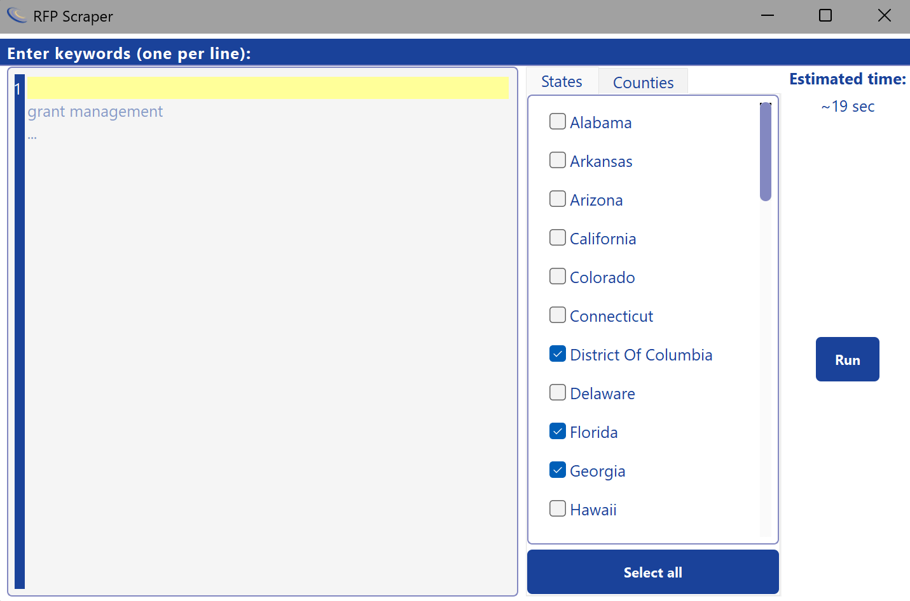
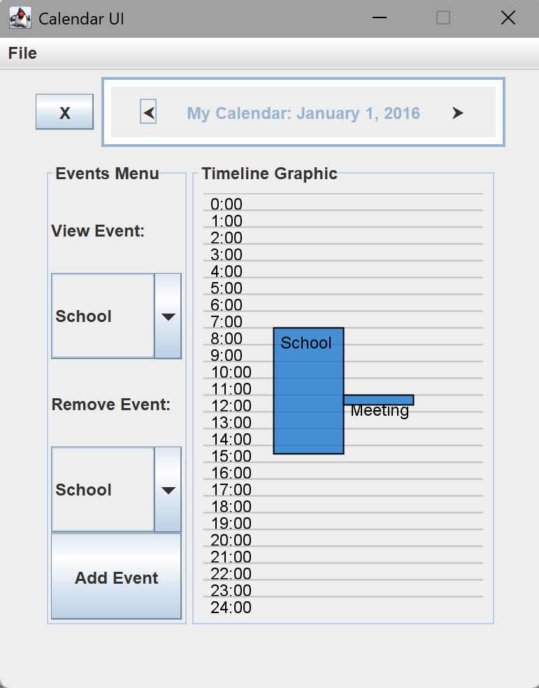

# 🚀 Jason Staker's GitHub Portfolio

Welcome! I’m Jason, a second-year Computer Science student at UBC passionate about rendering, physics simulation, and systems programming. Below are some of my featured projects, feel free to explore the code, demos, and write-ups.

## 🔭 Featured Projects

### 1. Schwarzschild Ray Tracer
**Repo:** [schwarzschild-ray-tracer](https://github.com/jasonstaker/schwarzschild-blackhole-renderer.git)

A high-performance C++ simulation tracing light around a Schwarzschild black hole. Utilizes numerical integration of null geodesics in curved spacetime, multithreaded rendering with OpenMP, and a GoogleTest suite for validation.

**Tech:** C++17 · OpenMP · CMake · GoogleTest · stb_image

---

### 2. 2D Physics Engine & Renderer
**Repo:** [2d-physics-demo](https://github.com/jasonstaker/2d-physics-demo.git)

A real-time 2D physics demo built in C++17 and SFML. Supports rigid-body dynamics, quadtree-based collision culling for 1K+ entities at 60 FPS, and interactive controls (pause, slow motion, overlays).

**Tech:** C++17 · SFML · JSON · Quadtree

---

### 3. RFP Web Scraper
**Repo:** [rfp-scraper](https://github.com/jasonstaker/rfp-scraper.git)

Automates fetching Requests for Proposals from all U.S. state procurement sites. Features a PyQt5 interface for keyword filtering, real-time log tailing, and Excel export, backed by robust retry logic.

**Tech:** Python · Selenium · Requests · Pandas · PyQt5

---

### 4. Java Swing Calendar App
**Repo:** [student-calendar](https://github.com/jasonstaker/student-calendar.git)

A hierarchical calendar GUI in Java Swing with JSON-backed persistence, event logging, and category management. Demonstrates clean MVC structure and AbstractAction-based navigation.

**Tech:** Java · Swing · JSON

---

## 📫 Connect with Me
- LinkedIn: [Jason Staker](https://www.linkedin.com/in/jasonstaker)
- Email: jason.staker@yahoo.com

*Thanks for visiting! Let me know if you have questions or feedback.*
